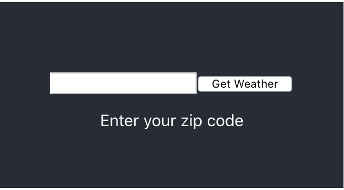
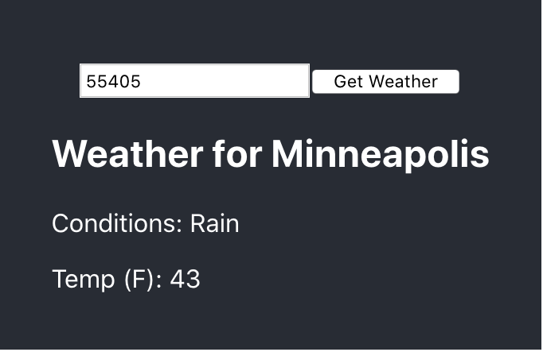

# Basic React Weather App

## Summary

This is a very basic weather app that allows you to enter your zip code and receive
the current weather conditions.

For this application to function properly, you must set the `REACT_APP_WEATHER_API_KEY`
environment variable to a valid Open Weather API key, which you can obtain
[here](https://openweathermap.org/api). Alternatively, Eric can provide
a `.env.local` file to place in the root of this directory with his key for demo purposes.

You can then run the app by installing the dependencies and running locally:

```
> npm install
> npm start
```

Here are some screenshots of the app in action:





## Development Notes

This project was bootstrapped with [Create React App](https://github.com/facebook/create-react-app).

The user interface is implemented in the `src/components` directory and uses only
very basic design.

The main logic of the app is in the `src/services/WeatherService.js` file. This is where
the app communicates with the Open Weather API and processes data for use in the app.
